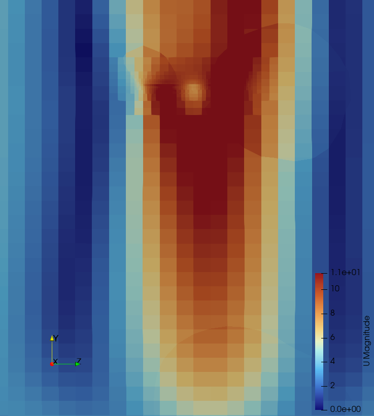
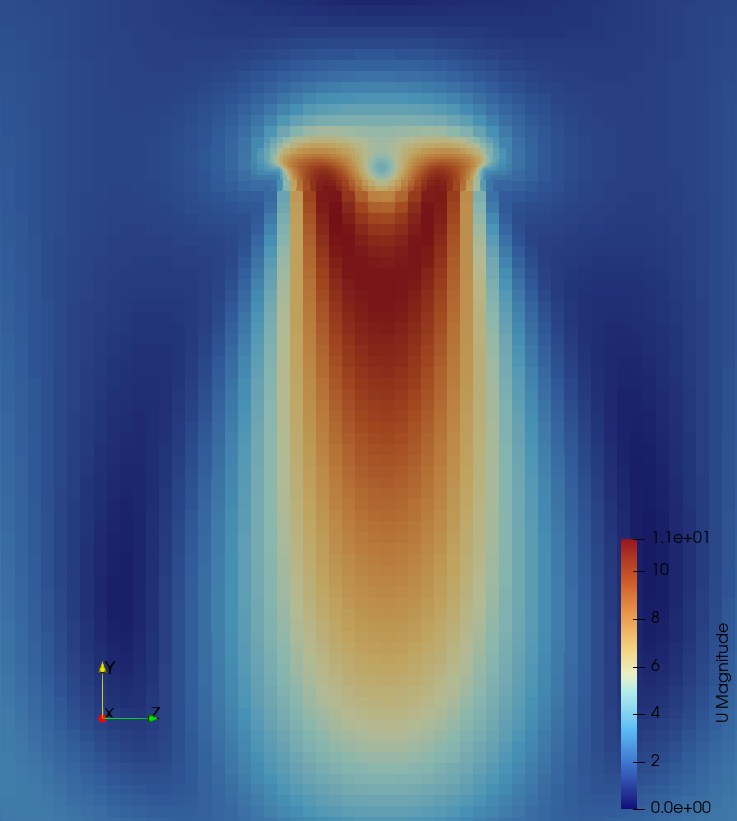
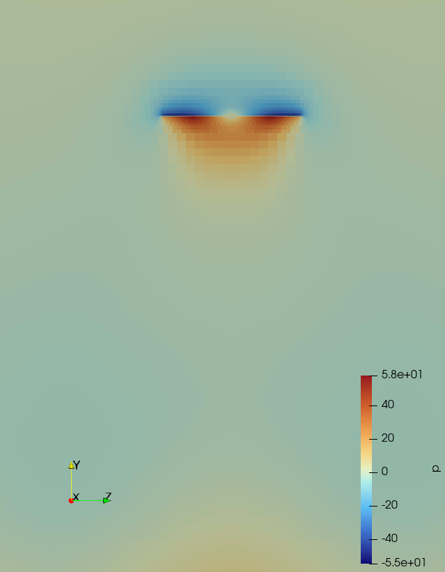
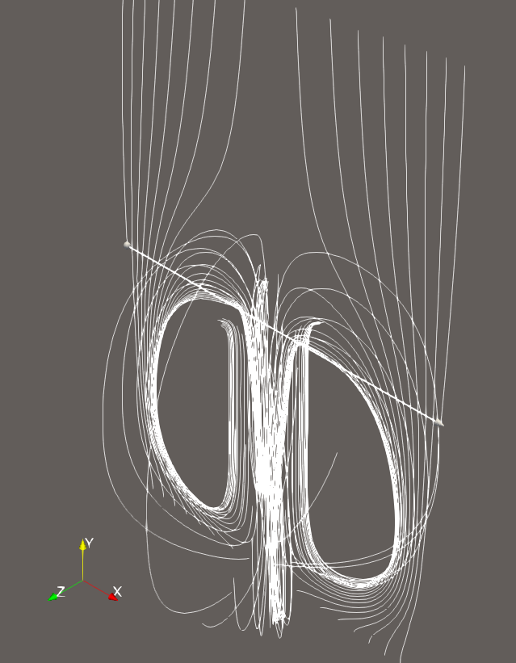
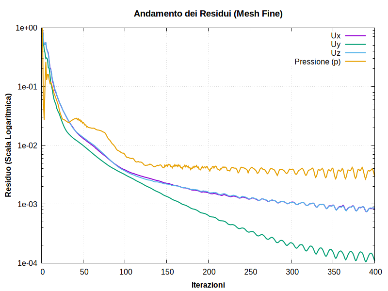
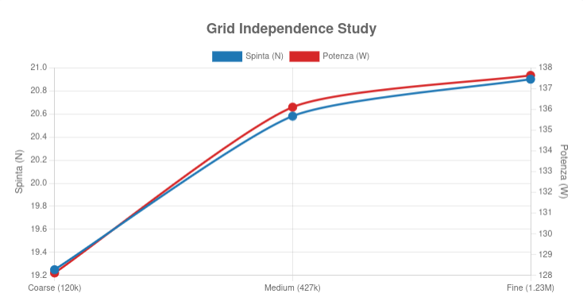

# Aerodynamic Analysis of a 21-inch Drone Propeller 🚁💨

## 📌 Project Overview

This project presents a Computational Fluid Dynamics (CFD) study of a 21-inch drone propeller operating in hover conditions at **4000 RPM**. The primary objective of this BSc project is to evaluate the aerodynamic performance (Thrust and Power) and to conduct a rigorous **Grid Independence Study**, including a formal numerical uncertainty estimate (GCI), to ensure the reliability of the results.

Simulations were performed using **OpenFOAM** with the **Actuator Disk model** (`rotorDisk`, via `fvModels`) and the `foamRun` solver (`incompressibleFluid`, steady-state SIMPLE), coupled with the **k-ω SST** turbulence model — well suited for rotating machinery and for capturing tip vortices and adverse pressure gradients. The Actuator Disk approach was chosen deliberately to avoid the much higher computational cost of a fully blade-resolved rotating mesh (MRF or sliding mesh), which is discussed as a natural extension of this work in the [Limitations & Future Work](#-limitations--future-work) section below.

---

## 👁️ Visual Post-Processing (ParaView)

High-quality post-processing was performed to analyze the flow physics around the propeller blades.

### Flow Velocity Field across Mesh Refinements

The following contours show the velocity magnitude at the blade section. Notice how the wake resolution and the blade tip vortices become significantly sharper and more physically accurate as the mesh is refined.

  

*Left to Right: Coarse, Medium, and Fine mesh velocity contours.*

### Pressure Distribution & Streamlines (Fine Mesh)

The pressure contour highlights the extreme ΔP between the pressure (lower) and suction (upper) sides of the blade, responsible for thrust generation. The streamlines reveal the strong induced downwash and the helical tip vortex structures typical of hovering rotors.

 

---

## 📊 Grid Independence Study

To guarantee that the solution is not dependent on the spatial discretization, three mesh levels were tested, keeping the local `snappyHexMesh` refinement levels constant and varying only the background mesh density.

| Mesh Level | Cell Count | Thrust [N] | Power [W] |
| ---------- | ---------- | ---------- | --------- |
| **Coarse** | 119,728    | 19.25      | 128.12    |
| **Medium** | 427,635    | 20.58      | 136.10    |
| **Fine**   | 1,235,717  | 20.90      | 137.63    |

 

### Numerical Uncertainty (Grid Convergence Index)

Rather than relying only on the percentage difference between mesh levels, the numerical uncertainty was quantified following the **Grid Convergence Index (GCI)** procedure (Celik et al., 2008 / ASME V&V20), which accounts for the non-constant refinement ratio between the three mesh levels (r₂₁ ≈ 1.43, r₃₂ ≈ 1.53).

| Quantity | Value |
| --- | --- |
| Observed order of convergence, p | ≈ 3.14 |
| Richardson-extrapolated Thrust (h→0) | ≈ 21.06 N |
| GCI on fine mesh (Thrust) | **≈ 0.93 %** → 20.90 N ± 0.19 N |

**Note on the observed order of convergence:** the discretization schemes used (`linearUpwind`, 2nd order nominal) would formally suggest p ≈ 2. The observed value (p ≈ 3.14) exceeding the nominal scheme order, together with the persistent low-amplitude oscillation visible in the residual plot above (which plateaus rather than decaying monotonically to machine precision), indicates that the solution has likely not fully entered the asymptotic grid-convergence range, and that iterative (non-fully-converged) error is partially contaminating the discretization error estimate. This is reported transparently as an honest characterization of the numerical uncertainty rather than treating the GIS as a fully closed, asymptotic result.

---

## 📈 Manufacturer Data vs. CFD Validation

A critical engineering assessment requires comparing numerical results with physical wind-stand tests provided by the manufacturer.

**Manufacturer Specs:**
- 3840 RPM → 2400 g (~23.54 N)
- 4290 RPM → 3000 g (~29.43 N)

Since propeller thrust scales quadratically with rotational speed (T ∝ Ω²), the manufacturer data was fitted (both linear interpolation and quadratic fit agree) to estimate the expected thrust at the simulation speed of **4000 RPM**, giving an expected physical value of **~25.6 N** (≈ 2.61 kg).

**Analytical Discussion of the Discrepancy:** The CFD Fine mesh predicts **20.90 N**, an underprediction of about **18%** compared to the RPM-scaled manufacturer data. This is an expected and well-documented phenomenon in rotor CFD, mainly due to:

1. **Aeroelastic Deformation:** the CFD model assumes a perfectly rigid blade, while a real 21-inch propeller undergoes aeroelastic twisting under load at 4000 RPM, which increases the effective local pitch and generates additional thrust compared to the static CAD geometry.
2. **Test-Stand Interference:** manufacturer data is gathered on static thrust stands, where the motor hub and test arm create a blockage effect that can artificially boost measured thrust.
3. **Idealized Domain:** the simulation assumes a perfectly undisturbed, infinite domain, while physical testing includes some room recirculation.
4. **Simplified Airfoil Data:** see [Limitations](#-limitations--future-work) — the actuator disk uses a single, generic symmetric airfoil polar for the entire span, rather than the real (and likely cambered, radially-varying) sections of the blade.

Given the rigid-rotor and idealized-polar limitations, the CFD results are considered coherent and provide a solid baseline for purely aerodynamic optimization.

---

## ⚠️ Limitations & Future Work

This project intentionally uses the Actuator Disk model to keep computational cost low while still producing a verified (via GCI) and validated (vs. manufacturer data) result. Being transparent about its limitations is, in my view, part of doing the analysis properly:

- **Single generic airfoil polar for the whole blade span.** The `rotorDisk` model currently uses one symmetric lookup polar (`profile1`) for every radial station, from root to tip. A real propeller uses different (typically cambered) sections along the span. A natural next step would be to generate per-station polars (e.g. via XFOIL/XFLR5) at the local Reynolds number, which varies significantly along the blade.
- **Tip-loss treated as a hard cutoff** (`tipEffect = 0.96`) rather than a continuous loss model (e.g. Prandtl's tip-loss function) — a reasonable first approximation, but a simplification worth revisiting.
- **Rigid blade assumption** — no aeroelastic coupling, discussed above as the likely main source of the ~18% gap with manufacturer data.
- **No independent low-order cross-check yet.** A Blade Element Momentum Theory (BEMT) estimate — using the same radius/twist/chord/polar data already defined in `fvModels` — would provide a third, independent data point alongside CFD and manufacturer data, and could be obtained quickly with a free GUI tool such as JavaProp or XFLR5, without requiring additional coding.
- **Blade-resolved simulation (MRF or sliding mesh) not attempted.** This would be the natural verification step to isolate how much of the 18% gap is due to the actuator disk's simplified aerodynamics (as opposed to the rigid-rotor/test-stand effects discussed above). It was not pursued here due to the computational cost (fine boundary-layer meshes and/or transient sliding-mesh runs typically require 5-20M+ cells and HPC resources) relative to the hardware available for this project (a 4-core/8-thread laptop CPU, 16 GB RAM). This is a natural extension of the project with access to university HPC resources.

---

## 🛠️ Methodology & HPC (High-Performance Computing)

To optimize calculation times and ensure reproducibility, the workflow was engineered with:
* **Bash Scripting**: automated mesh generation, solver execution, and data extraction (`Allrun`, `Allclean`, `estrai_dati.sh`).
* **Parallel Computing**: domain decomposition (`decomposePar`) with the Scotch method, running the RANS solver over 4 CPU physical cores simultaneously to accelerate the simulation.
* **Version Control**: Git integration to track dictionary configurations while strictly ignoring heavy binary mesh/time directories (`.gitignore`).

---

## 👨‍💻 Author

**Nicolò Sederino**
- BSc Student in Aerospace Engineering at Sapienza University of Rome
- Aerodynamic and structural engineer at: Sapienza Flight Team - SASA

## 📄 License

This project is licensed under the MIT License — see [LICENSE](LICENSE) for details.
