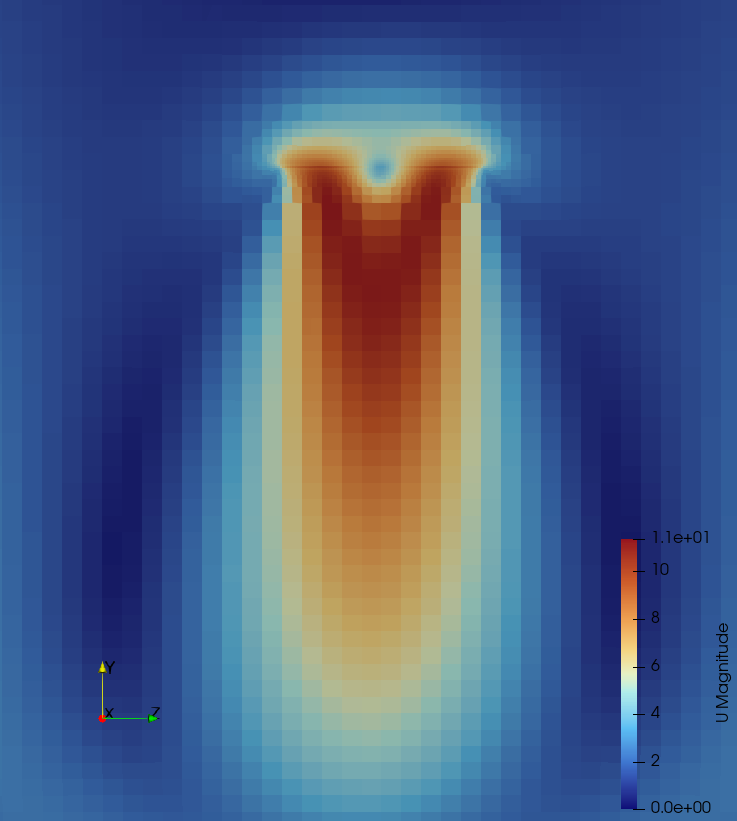

# 21-Inch Drone Propeller CFD Simulation (Actuator Disk Model)

A steady-state Computational Fluid Dynamics (CFD) analysis of a 21-inch drone propeller operating in hover conditions. The simulation is implemented in OpenFOAM using an Actuator Disk model to evaluate thrust generation, power consumption, pressure distribution, and numerical grid convergence.

---

## 1. Computational Setup
* **Solver:** Steady-state incompressible RANS (`foamRun` / `simpleFoam`)
* **Turbulence Model:** $k-\omega$ SST
* **Actuator Model:** Explicit pressure-jump formulation ($\Delta p$)
* **Domain:** Cylindrical atmospheric domain with far-field boundary conditions
* **Grid Independence:** Evaluated across 3 refinement levels (Coarse, Medium, Fine)

---

## 2. Aerodynamic Results & Pressure Jump

The Actuator Disk generates thrust by creating an explicit pressure jump across the rotor plane. The high-pressure region beneath the disk and low-pressure region above drive the air downward, generating the required hover thrust.

| Pressure Distribution ($\Delta P$) | Velocity Slice ($U$) |
| :---: | :---: |
|  |  |

---

## 3. Grid Independence Study (GIS)

To ensure that aerodynamic force predictions are independent of spatial discretization, a mesh convergence study was conducted across three refinement levels:

| Mesh Level | Cell Count | Thrust [N] | Power [W] |
| :--- | :---: | :---: | :---: |
| **Coarse** | 119,728 | 19.25 | 128.12 |
| **Medium** | 427,635 | 20.58 | 136.10 |
| **Fine** | 1,235,717 | 20.90 | 137.63 |

The thrust asymptotic convergence demonstrates that numerical errors associated with spatial discretization diminish significantly beyond the **Medium** mesh level, with less than **1.5% variation** between the Medium and Fine grids.

### Mesh Comparison & Refinement
| Coarse Grid (~120k) | Medium Grid (~427k) | Fine Grid (~1.2M) |
| :---: | :---: | :---: |
|  |  |  |

---

## 4. Numerical Convergence & Stability

Solution stability was verified by tracking the $L_1$ normalized residuals. All velocity components ($U_x, U_y, U_z$) converged well below the $10^{-3}$ threshold, while pressure ($p$) stabilized smoothly without unphysical oscillations.


---

## 5. How to Reproduce
To execute the simulation and recreate the mesh/results locally:

1. Navigate to the desired grid folder (e.g., `elica_drone_fine` for highest resolution):
   ```bash
   cd elica_drone_fine

2. Run the automated execution script  
    ./Allclean && ./Allrun
